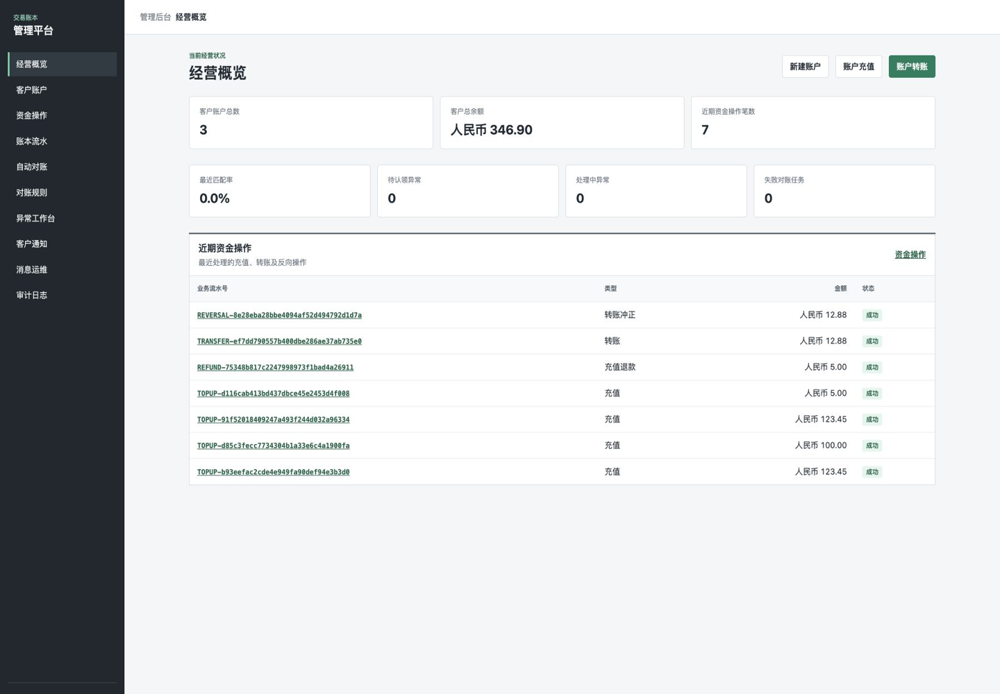
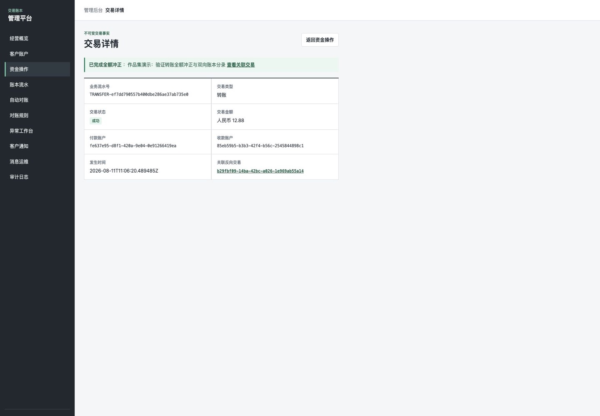
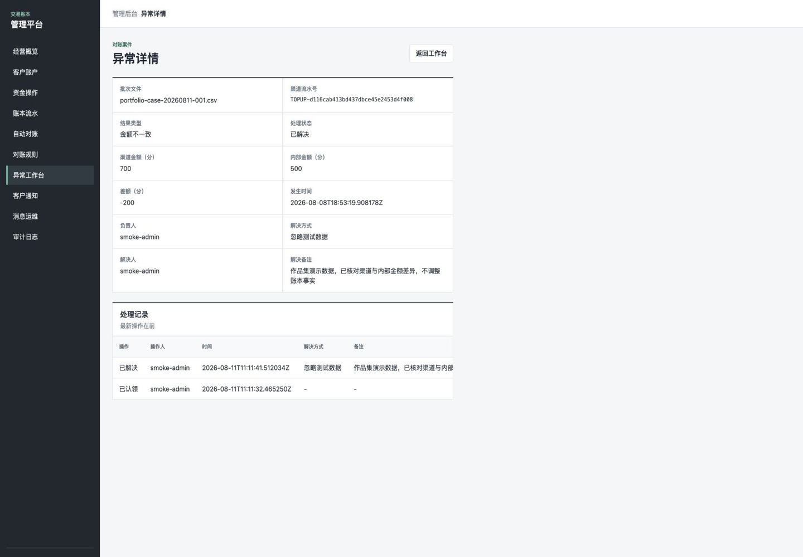
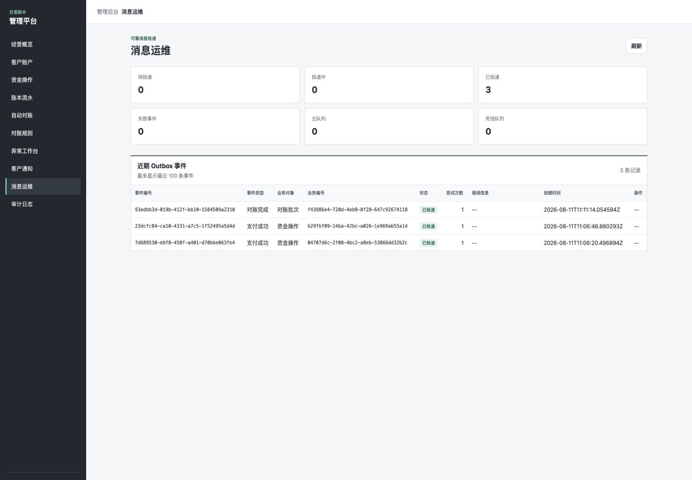
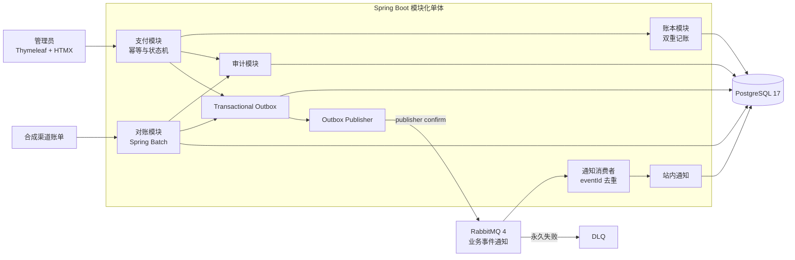

# Ledger Reconciliation Platform

[](https://github.com/32694/ledger-reconciliation-platform/actions/workflows/build.yml)

一个面向学习、简历和面试展示的 Java 交易账本与自动对账平台，重点演示资金一致性、可靠消息和对账运营闭环。系统只处理模拟资金和合成数据，不用于真实资金、客户数据或受监管生产场景。

## 界面预览

| 经营概览 | 交易详情与冲正 |
| --- | --- |
|  |  |
| 对账异常案件 | 消息运维 |
|  |  |

## 核心能力

- **资金一致性**：双重记账 journal 不可变，一笔业务的一借一贷必须同时提交并保持平衡。
- **支付可靠性**：充值、转账、退款和冲正使用幂等键、显式状态机及 PostgreSQL 行锁处理重复请求与并发扣款。
- **可恢复对账**：Spring Batch 分块处理合成渠道账单，保存规则版本、检查点、差异案件和处理时间线。
- **可靠消息**：Transactional Outbox 配合 RabbitMQ publisher confirm 实现 at-least-once 投递，消费者按 `eventId` 幂等去重。
- **审计闭环**：关键运营动作只追加记录结果，支付、账本、对账案件、通知和审计日志可相互核验。

这是一个 Spring Boot 模块化单体，包含以下模块：

- `identity`：管理员表单登录和启动时初始化管理员。
- `accounts`：创建、查询模拟客户账户，余额由账本分录计算。
- `ledger`：保存平衡且不可变的 journal，展示近期账本流水。
- `payments`：幂等充值、账户转账，以及成功充值的全额退款、成功转账的全额冲正。
- `reconciliation`：导入合成渠道账单，以 Spring Batch 分块执行可恢复对账，记录规则版本和差异处理。
- `messaging`：使用 Transactional Outbox 和 RabbitMQ 可靠投递支付成功、对账完成事件。
- `notifications`：按 `eventId` 幂等消费事件并生成站内通知。
- `audit`：记录管理员业务动作和结果，提供按 action/outcome 筛选的审计日志页面。

转账采用**双重记账**：一条 `DEBIT` 和一条 `CREDIT` 必须同时入账。PostgreSQL 行锁保证并发扣款按账户串行执行。

管理页面入口：

- `/admin`：经营概览和近期资金操作。
- `/admin/accounts`：客户账户。
- `/admin/payments/top-up`：账户充值。
- `/admin/payments/transfer`：账户转账。
- `/admin/ledger`：账本流水。
- `/admin/reconciliation`：自动对账。
- `/admin/reconciliation/cases`：异常工作台。
- `/admin/notifications`：站内通知。
- `/admin/messaging`：Outbox 状态、RabbitMQ 队列深度和失败事件重试。
- `/admin/audit`：审计日志。

近期资金操作表中的每条记录都可以打开交易详情。成功的充值可以提交**全额退款**，成功的转账可以提交**全额冲正**；操作要求填写原因和唯一幂等键。反向操作成功后，原交易保持不变，详情页互相显示原交易和反向交易链接，账本中保留两份不可变 journal。失败反向操作会保留底层失败码（例如 `INSUFFICIENT_FUNDS`），补足源钱包后必须使用新幂等键重试。

异步对账使用 Spring Batch，以 500 行为一个提交检查点。导入时选择已启用渠道，并锁定该渠道规则或默认规则的已发布、不可变版本。批次详情通过 HTMX 展示运行进度；可从失败前的检查点继续同一次运行，也可新建尝试重新处理。单个数据库只能由一个应用实例执行对账；多副本必须由部署环境的外部 leader election、lease 和 heartbeat 保证唯一调度者并检测失联，应用自身不实现这些协调机制。

对账差异在**异常工作台**中按待处理、处理中和已解决流转，认领、取消认领和解决操作形成不可变时间线，并同步写入审计日志。解决差异只记录运营结论，不会自动修改账本、支付或渠道账单事实。完整格式和操作步骤见[用户手册](docs/USER_GUIDE.md)。管理员业务动作会通过应用接口只追加地写入审计事件，应用不提供修改或删除入口；可在审计日志页按 action 和 outcome 筛选。

支付或对账事务在同一 PostgreSQL 事务中写入 Transactional Outbox，后台 Publisher 通过 RabbitMQ publisher confirm 确认投递。该链路采用 **at-least-once** 语义，消费者以 `eventId` 做幂等消费；短暂故障会自动重试，永久失败消息进入 DLQ。RabbitMQ 只承担业务事件通知，不替代 Spring Batch 对账任务。

## 系统架构



支付和对账在各自业务事务中同时写入事实数据、审计记录和 Outbox 事件。RabbitMQ 只传递业务通知事件，不调度 Spring Batch 对账任务；链路采用 at-least-once 投递，通知消费者通过 `eventId` 去重。

## 三分钟演示

先按 [快速启动](#快速启动) 运行全部服务并登录管理端。

1. 创建两个合成账户并充值，幂等键 `demo-topup-001`。
2. 转账、检查金额相等的一借一贷分录、用 `demo-reversal-001` 全额冲正并确认原/反向互链；重复时更换序号。
3. 查看站内通知和消息运维，确认同一 `eventId` 只生成一条通知。
4. 按 [用户手册](docs/USER_GUIDE.md) 导入合成渠道账单并等待 Spring Batch 对账。
5. 在异常工作台认领和解决差异，核对案件时间线和审计日志。

100,000 行与故障恢复见下方性能章节和用户手册。

## 技术栈

- JDK 17、Spring Boot 3.5、Spring Modulith
- Spring Data JPA、Hibernate、PostgreSQL 17、Flyway
- Spring AMQP、RabbitMQ 4、Transactional Outbox
- Thymeleaf、HTMX、Spring Security、响应式管理页面
- JUnit 5、AssertJ、MockMvc、Spring Modulith Test、ArchUnit
- Maven Wrapper、Docker Compose、GitHub Actions

## 前置条件

- Git 与 POSIX 兼容 shell
- JDK 17
- Docker Compose（推荐），或本机 JDK 17、PostgreSQL 17 和 RabbitMQ 4

## 快速启动

```sh
cp .env.example .env
# 修改 .env 中的数据库、RabbitMQ 和管理员密码。
docker compose up --build
```

打开 <http://localhost:8080/login>，使用 `APP_ADMIN_USERNAME` 和 `APP_ADMIN_PASSWORD` 登录；RabbitMQ 管理页面为 <http://localhost:15672>。Compose 会从 `.env` 读取配置，Flyway 在应用启动阶段自动执行待执行迁移。

需要在宿主机运行 Java 时，可先执行 `docker compose up -d db rabbitmq`，再导出 `.env` 并启动：

```sh
set -a
. ./.env
set +a
./mvnw spring-boot:run
```

完整的本地启动、业务操作、失败重试和常见错误处理见[用户手册](docs/USER_GUIDE.md)；迁移到另一台电脑或迁移 PostgreSQL 数据见[迁移手册](docs/MIGRATION.md)。

## 验证

准备好 `ledger_platform_test` 后运行：

```sh
SPRING_DATASOURCE_URL=jdbc:postgresql://localhost:5432/ledger_platform_test \
SPRING_DATASOURCE_USERNAME="$DB_USERNAME" \
SPRING_DATASOURCE_PASSWORD="$DB_PASSWORD" \
./mvnw clean verify
./mvnw -Pmessaging-integration verify
```

第一条命令编译、执行普通测试并生成可运行的 JAR；第二条命令在 RabbitMQ 已启动时增加真实 Broker 集成测试。产物为 `target/ledger-reconciliation-platform-0.1.0-SNAPSHOT.jar`。

## 100,000 行演示

生成确定性渠道账单：

```sh
scripts/generate-reconciliation-demo.sh ./reconciliation-demo.csv 100000
```

性能验证是 opt-in，不包含在默认测试中：

```sh
SPRING_DATASOURCE_URL=jdbc:postgresql://localhost:5432/ledger_platform_test \
SPRING_DATASOURCE_USERNAME="$DB_USERNAME" \
SPRING_DATASOURCE_PASSWORD="$DB_PASSWORD" \
./mvnw -Preconciliation-performance -Dit.test=ReconciliationPerformanceIT verify
```

该验证会演示 100,000 行分块处理、一次确定性失败后的同一运行恢复，并打印 `elapsedMs`、`channelRowsPerSecond`、`channelRows`、`resultRows` 和 `restartCount`；不以固定耗时阈值判定结果。

## 许可证

本项目采用 [MIT License](LICENSE)。
