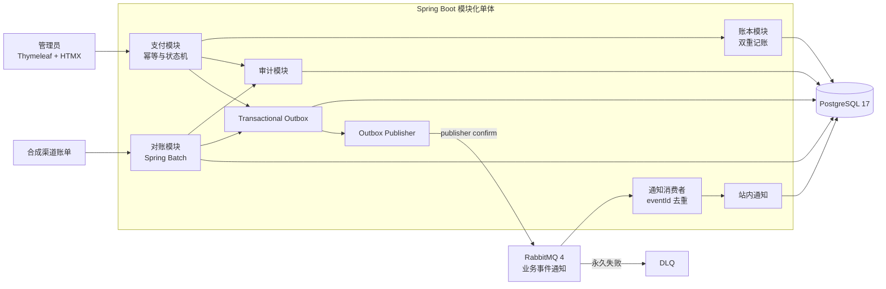

# Portfolio Showcase and Repository Hygiene Implementation Plan

> **For agentic workers:** REQUIRED SUB-SKILL: Use superpowers:subagent-driven-development (recommended) or superpowers:executing-plans to implement this plan task-by-task. Steps use checkbox (`- [ ]`) syntax for tracking.

**Goal:** 将现有交易账本与自动对账平台整理成可直接用于简历和面试展示的 GitHub 仓库，同时补齐许可证和系统文件忽略规则。

**Architecture:** 只修改仓库展示材料和 `DocumentationTest`，不触碰业务 Java 代码、数据库迁移或运行配置。用测试锁定 README 的稳定入口、四张本地 PNG 截图和 MIT 许可证，再从真实中文管理页面获取脱敏截图并完成 README 架构与演示说明。

**Tech Stack:** Markdown、Mermaid、JUnit 5、AssertJ、GitHub Actions、Thymeleaf/HTMX 管理页面、PNG

---

## File Map

- Modify: `.gitignore` - 忽略 macOS `.DS_Store`。
- Create: `LICENSE` - 标准 MIT 许可证，版权人为 `32694`。
- Modify: `src/test/java/io/github/user32694/ledgerplatform/DocumentationTest.java` - 锁定许可证、README 展示入口和截图文件。
- Create: `docs/images/operations-overview.png` - 真实经营概览截图。
- Create: `docs/images/payment-detail-reversal.png` - 真实交易详情与冲正截图。
- Create: `docs/images/reconciliation-case.png` - 真实对账案件截图。
- Create: `docs/images/messaging-operations.png` - 真实消息运维截图。
- Modify: `README.md` - 增加徽章、界面预览、核心能力、Mermaid 架构图、三分钟演示和许可证入口。

### Task 1: Add MIT License and Ignore macOS Metadata

**Files:**
- Modify: `src/test/java/io/github/user32694/ledgerplatform/DocumentationTest.java:15-22`
- Create: `LICENSE`
- Modify: `.gitignore:1-10`

- [ ] **Step 1: Add the license to the existing portable-file contract**

在 `portableRuntimeDocumentationExists` 的 `@ValueSource` 中加入根目录许可证：

```java
    @ParameterizedTest
    @ValueSource(strings = {
        ".env.example",
        ".dockerignore",
        "Dockerfile",
        "compose.yaml",
        "LICENSE",
        "docs/USER_GUIDE.md",
        "docs/MIGRATION.md"
    })
```

- [ ] **Step 2: Run the focused test and verify the red state**

Run:

```sh
./mvnw -Dtest=DocumentationTest#portableRuntimeDocumentationExists test
```

Expected: FAIL，失败信息指出 `LICENSE should be a regular file`。

- [ ] **Step 3: Add the complete MIT license**

创建 `LICENSE`，内容必须完全如下：

```text
MIT License

Copyright (c) 2026 32694

Permission is hereby granted, free of charge, to any person obtaining a copy
of this software and associated documentation files (the "Software"), to deal
in the Software without restriction, including without limitation the rights
to use, copy, modify, merge, publish, distribute, sublicense, and/or sell
copies of the Software, and to permit persons to whom the Software is
furnished to do so, subject to the following conditions:

The above copyright notice and this permission notice shall be included in all
copies or substantial portions of the Software.

THE SOFTWARE IS PROVIDED "AS IS", WITHOUT WARRANTY OF ANY KIND, EXPRESS OR
IMPLIED, INCLUDING BUT NOT LIMITED TO THE WARRANTIES OF MERCHANTABILITY,
FITNESS FOR A PARTICULAR PURPOSE AND NONINFRINGEMENT. IN NO EVENT SHALL THE
AUTHORS OR COPYRIGHT HOLDERS BE LIABLE FOR ANY CLAIM, DAMAGES OR OTHER
LIABILITY, WHETHER IN AN ACTION OF CONTRACT, TORT OR OTHERWISE, ARISING FROM,
OUT OF OR IN CONNECTION WITH THE SOFTWARE OR THE USE OR OTHER DEALINGS IN THE
SOFTWARE.
```

- [ ] **Step 4: Ignore `.DS_Store`**

在 `.gitignore` 的 IDE 忽略项之前加入：

```gitignore
.DS_Store
```

- [ ] **Step 5: Verify the focused contract and ignore rule**

Run:

```sh
./mvnw -Dtest=DocumentationTest#portableRuntimeDocumentationExists test
git check-ignore -v .DS_Store
```

Expected: Maven 显示 `BUILD SUCCESS`；`git check-ignore` 输出 `.gitignore` 中的 `.DS_Store` 规则。

- [ ] **Step 6: Commit repository hygiene**

```sh
git add .gitignore LICENSE src/test/java/io/github/user32694/ledgerplatform/DocumentationTest.java
git commit -m "docs: 增加开源许可证与系统文件忽略"
```

### Task 2: Add the Failing Portfolio Documentation Contract

**Files:**
- Modify: `src/test/java/io/github/user32694/ledgerplatform/DocumentationTest.java:28`

- [ ] **Step 1: Add one focused showcase test below `portableRuntimeDocumentationExists`**

```java
    @org.junit.jupiter.api.Test
    void documentsPortfolioShowcase() throws IOException {
        String readme = Files.readString(Path.of("README.md"));
        var screenshots = java.util.List.of(
                "docs/images/operations-overview.png",
                "docs/images/payment-detail-reversal.png",
                "docs/images/reconciliation-case.png",
                "docs/images/messaging-operations.png");

        for (String screenshot : screenshots) {
            Path screenshotPath = Path.of(screenshot);
            assertThat(Files.isRegularFile(screenshotPath))
                    .as("%s should be a regular file", screenshot)
                    .isTrue();
            assertThat(Files.size(screenshotPath))
                    .as("%s should not be empty", screenshot)
                    .isGreaterThan(0L);
            assertThat(readme).contains("(" + screenshot + ")");
        }

        assertThat(readme)
                .contains("https://github.com/32694/ledger-reconciliation-platform/actions/workflows/build.yml")
                .contains("## 界面预览", "## 系统架构", "## 三分钟演示")
                .contains("```mermaid")
                .contains("Transactional Outbox", "RabbitMQ", "Spring Batch", "at-least-once", "eventId")
                .contains("[用户手册](docs/USER_GUIDE.md)")
                .contains("[迁移手册](docs/MIGRATION.md)")
                .contains("[MIT License](LICENSE)");
    }
```

- [ ] **Step 2: Run the focused test and verify the red state**

Run:

```sh
./mvnw -Dtest=DocumentationTest#documentsPortfolioShowcase test
```

Expected: FAIL，首个失败断言指出 `docs/images/operations-overview.png should be a regular file`。

不要在红灯状态提交；Task 3 和 Task 4 将逐步满足该契约。

### Task 3: Capture Four Real Chinese Management Screenshots

**Files:**
- Create: `docs/images/operations-overview.png`
- Create: `docs/images/payment-detail-reversal.png`
- Create: `docs/images/reconciliation-case.png`
- Create: `docs/images/messaging-operations.png`

**Required sub-skill:** `browser:control-in-app-browser`

- [ ] **Step 1: Confirm the application and signed-in session**

打开 `http://localhost:8080/admin`。若跳转到 `/login`，使用用户本机已有管理员凭据登录；不得把密码写入仓库、终端历史或计划执行记录。确认页面标题和导航均为中文。

- [ ] **Step 2: Prepare only synthetic demonstration data through existing pages**

使用 `/admin/accounts`、`/admin/payments/top-up` 和 `/admin/payments/transfer` 创建两个明确标为演示用途的账户、一笔充值和一笔转账。幂等键使用：

```text
portfolio-topup-20260811-001
portfolio-transfer-20260811-001
portfolio-reversal-20260811-001
```

如果这些键已存在，将末尾序号依次改为 `002`、`003`。在转账详情页完成全额冲正，使详情页同时显示原交易、反向交易和成对账本分录。使用现有合成渠道账单导入流程生成至少一条对账差异，认领该案件并填写不含人员信息的演示处理说明。等待 Outbox 发布完成，确保消息运维页有可读状态记录。

- [ ] **Step 3: Capture at a stable desktop viewport**

将浏览器视口固定为 `1440 x 1000`，逐页等待动态内容稳定后截图，只截网页内容，不包含地址栏、书签栏或桌面：

依次打开经营概览和消息运维固定路由；交易详情从经营概览中点击刚完成冲正的转账进入，确认最终地址匹配 `/admin/payments/<UUID>`；案件详情从异常工作台点击刚认领的案件进入，确认最终地址匹配 `/admin/reconciliation/cases/<UUID>`：

```text
http://localhost:8080/admin
http://localhost:8080/admin/messaging
```

按顺序保存为：

```text
docs/images/operations-overview.png
docs/images/payment-detail-reversal.png
docs/images/reconciliation-case.png
docs/images/messaging-operations.png
```

- [ ] **Step 4: Verify format, dimensions, and non-empty files**

Run:

```sh
file docs/images/*.png
for image in docs/images/*.png; do sips -g pixelWidth -g pixelHeight "$image"; done
```

Expected: 四个文件均识别为 PNG；每张图宽度为 `1440`，高度大于 `600`，文件大小非零。

- [ ] **Step 5: Visually inspect every screenshot**

使用本地图片查看工具逐张检查。每张图必须文字清晰、页面对应正确、没有加载遮罩或内容重叠，并且不出现密码、Cookie、令牌、本机路径、真实人员或公司信息。发现不符合项时重新截图覆盖对应文件。

- [ ] **Step 6: Confirm the contract now advances to the README failure**

Run:

```sh
./mvnw -Dtest=DocumentationTest#documentsPortfolioShowcase test
```

Expected: FAIL 原因不再是截图文件缺失，而是 README 尚未引用图片或缺少展示章节。

### Task 4: Restructure the README for Repository Visitors

**Files:**
- Modify: `README.md:1-108`
- Test: `src/test/java/io/github/user32694/ledgerplatform/DocumentationTest.java`

- [ ] **Step 1: Add the CI badge and positioning below the title**

README 开头使用：

```markdown
# Ledger Reconciliation Platform

[](https://github.com/32694/ledger-reconciliation-platform/actions/workflows/build.yml)

一个面向学习、简历和面试展示的 Java 交易账本与自动对账平台，重点演示资金一致性、可靠消息和对账运营闭环。系统只处理模拟资金和合成数据，不用于真实资金、客户数据或受监管生产场景。
```

- [ ] **Step 2: Add the four-image preview immediately after positioning**

```markdown
## 界面预览

| 经营概览 | 交易详情与冲正 |
| --- | --- |
|  |  |
| 对账异常案件 | 消息运维 |
|  |  |
```

- [ ] **Step 3: Rename `当前能力` to `核心能力` and retain the existing truthful module list**

在模块列表之前增加摘要，原有 `identity` 到 `audit` 八个模块说明、并发边界、反向交易约束、对账恢复约束和可靠消息语义全部保留：

```markdown
## 核心能力

- **资金一致性**：双重记账 journal 不可变，一笔业务的一借一贷必须同时提交并保持平衡。
- **支付可靠性**：充值、转账、退款和冲正使用幂等键、显式状态机及 PostgreSQL 行锁处理重复请求与并发扣款。
- **可恢复对账**：Spring Batch 分块处理合成渠道账单，保存规则版本、检查点、差异案件和处理时间线。
- **可靠消息**：Transactional Outbox 配合 RabbitMQ publisher confirm 实现 at-least-once 投递，消费者按 `eventId` 幂等去重。
- **审计闭环**：关键运营动作只追加记录结果，支付、账本、对账案件、通知和审计日志可相互核验。

这是一个 Spring Boot 模块化单体，包含以下模块：
```

- [ ] **Step 4: Add the architecture diagram after the reliable-messaging explanation**

````markdown
## 系统架构



支付和对账在各自业务事务中同时写入事实数据、审计记录和 Outbox 事件。RabbitMQ 只传递业务通知事件，不调度 Spring Batch 对账任务；链路采用 at-least-once 投递，通知消费者通过 `eventId` 去重。
````

编辑 Markdown 时，外层计划代码块不能写入 README；README 中只保留从 `## 系统架构` 到架构说明的内容，并保证 Mermaid 围栏完整闭合。

- [ ] **Step 5: Add the three-minute demonstration before `技术栈`**

```markdown
## 三分钟演示

先按[快速启动](#快速启动)运行全部服务并登录管理端，然后依次完成：

1. 在“客户账户”创建两个合成账户，在“账户充值”给付款账户充值；幂等键可使用 `demo-topup-001`。
2. 发起一笔转账并打开交易详情，检查金额相等的一借一贷分录；随后使用 `demo-reversal-001` 提交全额冲正，确认原交易与反向交易互相链接。重复演示时需更换幂等键末尾序号。
3. 打开“站内通知”和“消息运维”，确认支付事件已发布且同一 `eventId` 只生成一条通知。
4. 按[用户手册](docs/USER_GUIDE.md)导入合成渠道账单，等待 Spring Batch 对账完成。
5. 在“异常工作台”认领并解决一条差异，最后在案件时间线和审计日志中核对操作记录。

100,000 行账单和故障恢复演示见下方性能章节及用户手册。
```

- [ ] **Step 6: Add the license section at the end**

```markdown
## 许可证

本项目采用 [MIT License](LICENSE)。
```

- [ ] **Step 7: Run focused and complete documentation tests**

Run:

```sh
./mvnw -Dtest=DocumentationTest#documentsPortfolioShowcase test
./mvnw -Dtest=DocumentationTest test
```

Expected: 两条命令均显示 `BUILD SUCCESS`。

- [ ] **Step 8: Commit the showcase contract, images, and README**

```sh
git add README.md docs/images src/test/java/io/github/user32694/ledgerplatform/DocumentationTest.java
git commit -m "docs: 完善项目展示与三分钟演示"
```

### Task 5: Run Full Regression and Presentation Review

**Files:**
- Verify only: all files changed in Tasks 1-4

- [ ] **Step 1: Run formatting and sensitive-content checks**

Run:

```sh
git diff main...HEAD --check
rg -n "/Users/|password=|Cookie:|Authorization:|BEGIN (RSA|OPENSSH|EC) PRIVATE KEY" README.md docs/USER_GUIDE.md docs/MIGRATION.md LICENSE || true
```

Expected: `git diff --check` 无输出；敏感内容搜索无命中。README 中讲解“密码”概念的普通中文不受该规则影响，因为搜索目标是 `password=`。

- [ ] **Step 2: Run the full baseline suite against the isolated test database**

Run:

```sh
SPRING_DATASOURCE_URL=jdbc:postgresql://localhost:5432/ledger_platform_portfolio_test \
SPRING_DATASOURCE_USERNAME=ledger_app \
SPRING_DATASOURCE_PASSWORD=ledger_app \
./mvnw test
```

Expected: `Tests run: 387, Failures: 0, Errors: 0, Skipped: 2` 和 `BUILD SUCCESS`。

- [ ] **Step 3: Review repository scope and history**

Run:

```sh
git status --short --branch
git log --oneline main..HEAD
git diff --stat main...HEAD
git diff --name-only main...HEAD
```

Expected: 工作区干净；提交历史包含设计、计划、许可证整理和项目展示提交；变更文件只落在设计规格列出的路径以及本实施计划自身，不包含业务 Java 源码、Flyway 迁移、Compose 或应用配置。

- [ ] **Step 4: Perform final visual acceptance**

再次逐张打开四张 PNG，确认统一尺寸、中文清晰、无敏感信息、无重叠。检查 README 中四个相对路径与实际文件名完全一致，并人工核对 Mermaid 节点和三分钟演示步骤与现有路由、用户手册一致。

- [ ] **Step 5: Commit only if verification required corrections**

如果验收中修正了 README 或重新生成了截图，运行聚焦文档测试后提交：

```sh
./mvnw -Dtest=DocumentationTest test
git add README.md docs/images src/test/java/io/github/user32694/ledgerplatform/DocumentationTest.java
git commit -m "docs: 修正项目展示验收问题"
```

Expected: 测试成功且提交只包含实际修正。若没有任何修正，不创建空提交。
